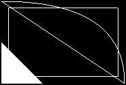

# Drawing format
Refer to `assets/drawings/` for more complicated examples

## JSON format
Root object contains:
  * `origin_size`: size of the display the drawing was originally created upon, for scaling; format: `coord`
  * `size`: the size of the drawing itself, for scaling; format: `coord`
  * `elements`: array of individual drawing elements; format: `{"type": string, "data": type-dependent}`

Element types:
  * `line`: 2-element array of `coord`
  * `triangle`: 3-element array of `coord`, the triangle is filled
  * `rectangle`: 4-element array of `coord`, the rectangle is empty
  * `bezier_curve`: object containing `start`, `control`, `end` keys, each of `coord` format

`coord` format: `{"x": int, "y": int}`

Any and all extraneous keys are ignored.

## Example
```json
{
	"origin_size": {"x": 1600, "y": 900},
	"size":        {"x": 180,  "y": 120},
	"elements": [
		{
			"type": "line",
			"data": [
				{"x": 0,   "y": 0},
				{"x": 180, "y": 120}
			]
		},
		{
			"type": "triangle",
			"data": [
				{"x": 0,  "y": 60},
				{"x": 0,  "y": 120},
				{"x": 60, "y": 120}
			]
		},
		{
			"type": "rectangle",
			"data": [
				{"x": 10,  "y": 10},
				{"x": 170, "y": 10},
				{"x": 170, "y": 110},
				{"x": 10,  "y": 110}
			]
		},
		{
			"type": "bezier_curve",
			"data": {
				"start":   {"x": 0, "y": 0},
				"control": {"x": 180, "y": 0},
				"end":     {"x": 180, "y": 120}
			}
		}
	]
}
```
<br />
Result:


